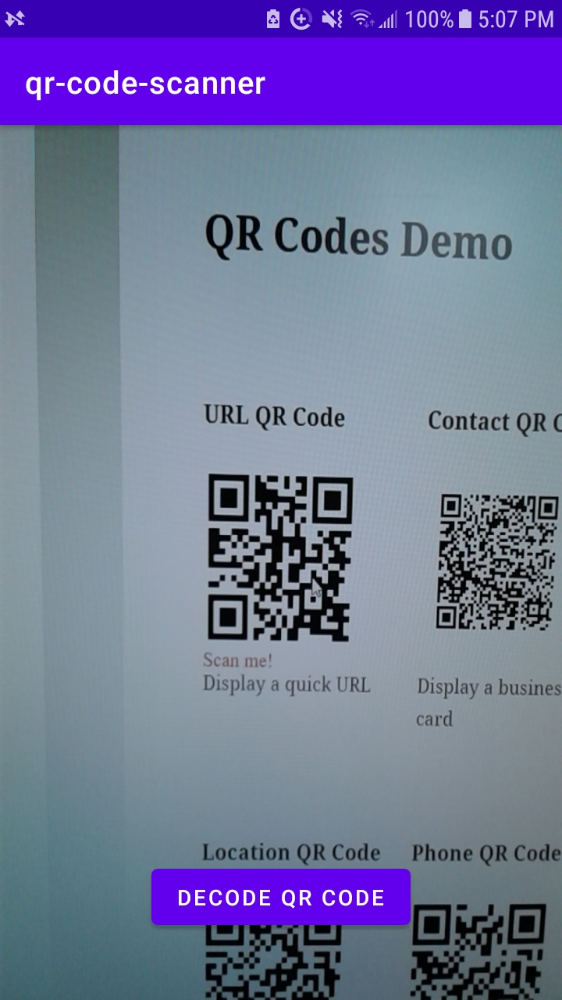
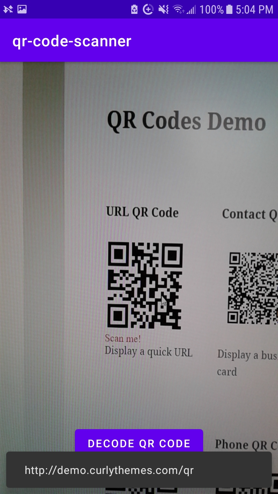

# mobile QR code scanner   
### an Android application for decoding QR codes using the ZXing library    
    
screenshots (tested with a Samsung Galaxy J3 and <a href='https://demo.curlythemes.com/qr/qr-codes-demo/'>this website</a>):    
    
    
upon QR code decoding:    
    
    
It works ok and gets the job done I think for the most part. Sometimes it takes a couple tries to get results and also possibly because autofocusing isn't currently working quite the way I was hoping (I'm having difficulty capturing the image precisely when the camera is focused).    
    
## TODO:    
- go to link when decoded from QR code?
- change UI color (offer options?)
    
## acknowledgements:
Thanks to the ZXing team (Sean Owen et al.). The library is pretty cool and works well enough :)     
    
Thanks to Jiankai Sun for having an <a href='https://github.com/Jiankai-Sun/Android-Camera2-API-Example'>example project</a> to reference and Mateusz Dziubek for an <a href='https://medium.com/android-news/the-least-you-can-do-with-camera2-api-2971c8c81b8b'>excellent tutorial</a>. I used their resources the most throughout this project but many thanks also to all the people involved in the links I've included in `qr-code-scanner-prj.txt`!